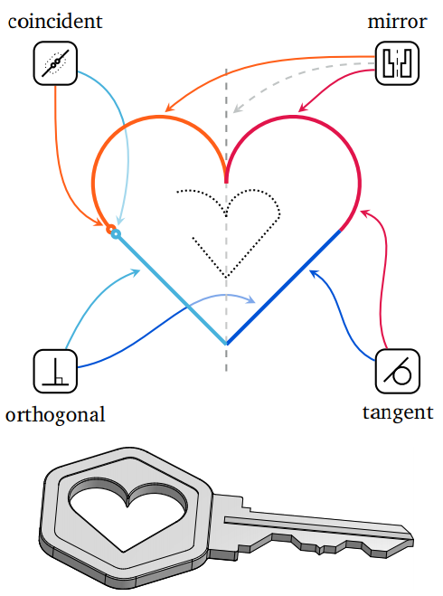

# <p align=center>`Awesome Transformer in CV`</p>
<p align="center">
  
</p>

<!--[](https://github.com/sindresorhus/awesome) -->

  

A collection of resources on Transformer in CV.

## <span id="head-content"> *Content* </span>
* - [ ] [1. Description](#head1)
* - [ ] [2. Survey](#head2)
* - [ ] [3. Paper With Code](#head3)
  * - [ ] [Theoretical Thinking](#head-Theoretical-Thinking)
  * - [ ] [Backbone](#head-Backbone)
  * - [ ] [Vision and Language](#head-Vision-and-Language)
  * - [ ] [Image Classification](#head-Image-Classification)
  * - [ ] [Object Detection](#head-Object-Detection)
  * - [ ] [Object Tracking](#head-Object-Tracking)
  * - [ ] [Instance Segmentation](#head-Instance-Segmentation)
  * - [ ] [Semantic Segmentation](#head-Semantic-Segmentation)
  * - [ ] [Image Retrieval](#head-Image-Retrieval)
  * - [ ] [Video Understanding](#head-Video-Understanding)
  * - [ ] [Monocular Depth Estimation](#head-Monocular-Depth-Estimation)
  * - [ ] [GAN](#head-GAN)
  * - [ ] [Deepfake Detection](#head-Deepfake-Detection) 
  * - [ ] [Perceptual Representation](#head-Perceptual-Representation)
  * - [ ] [Low Level Vision](#head-Low-Level-Vision)
  * - [ ] [Sign Language](#head-Sign-Language)
  * - [ ] [Medical Image Segmentation](#head-Medical-Image-Segmentation)
  * - [ ] [Other Applications](#head-Other-Applications)
  * - [ ] [Beyond Transformer](#head-Beyond-Transformer)

* [*Contact Me*](#head4)

## <span id="head1"> *1. Description* </span>
>🐌 Markdown Format:
>
> * (Conference/Journal Year) **Title**, First Author et al. [[Paper](URL)] [[Code](URL)] [[Project](URL)]
>     * (Optional) ```🌱``` or ```📌 ```
>     * (Optional) ⭐ or 👑 or 📚

* ```🌱: Novel idea```
* ```📌: The first...```
* ⭐: State-of-the-Art
* 👑: Novel dataset
* 📚：Multiple Tasks 

## <span id="head2"> *2. Survey* </span>
**[`       «🎯Back To Top»       `](#)**
* 『[**Visual Transformer Blog**](https://blog.csdn.net/u014636245/article/details/116333223) in Chinese』Proudly produced by [@JieJi](https://blog.csdn.net/u014636245)
* (arXiv preprint 2021) **A Survey of Transformers** [[v1](https://arxiv.org/pdf/2106.04554v1.pdf)](2021.06.08)  [[v2](https://arxiv.org/pdf/2106.04554v2.pdf)](2021.06.15) 
* (arXiv preprint 2021) **Transformers in Vision: A Survey** [[v1](https://arxiv.org/pdf/2101.01169v1.pdf)](2021.01.04) [[v2](https://arxiv.org/pdf/2101.01169v2.pdf)](2021.02.22)
* (arXiv preprint 2020+2021) **A Survey on Visual Transformer** [[v1](https://arxiv.org/pdf/2012.12556v1.pdf)](2020.12.23) [[v2](https://arxiv.org/pdf/2012.12556v2.pdf)](2021.01.15) [[v3](https://arxiv.org/pdf/2012.12556v3.pdf)](2021.01.30)
## <span id="head3"> *3. Paper With Code* </span>

  * <span id="head-Theoretical-Thinking"> **Theoretical Thinking**  </span> **[`       «🎯Back To Top»       `](#)**
      * (ICCV 2021) **AutoFormer: Searching Transformers for Visual Recognition**, Minghao Chen et al. [[Paper](https://arxiv.org/pdf/2107.00651.pdf)] [[Code](https://github.com/microsoft/AutoML/tree/main/AutoFormer)] 

        
        > *(From: https://github.com/microsoft/AutoML/tree/main/AutoFormer)*
        
        * ```📌 First effort to design an automatic search algorithm for finding vision transformer models.```
        * ```🌱 Without extra finetuning or retraining, the trained supernet is able to produce thousands of high-quality transformers by inheriting weights from it directly. ```
      * (ICCV 2021) **An Empirical Study of Training Self-Supervised Vision Transformers**, Xinlei Chen et al. [[Paper](https://arxiv.org/pdf/2104.02057v3.pdf)] 
        * ```🌱 Instability is a major issue that degrades accuracy, and it can be hidden by apparently good results. ```
      * (ICCV 2021) **Rethinking and Improving Relative Position Encoding for Vision Transformer**, Kan Wu et al. [[Paper](https://houwenpeng.com/publications/iRPE.pdf)] [[Code](https://github.com/microsoft/AutoML/tree/main/iRPE)] 
        * ```🌱 image RPE (iRPE): New relative position encoding methods dedicated to 2D images which consider directional relative distance modeling as well as the interactions between queries and relative position embeddings in a self-attention mechanism.  ```
        * ```🌱 Simple, lightweight and can be easily plugged into transformer blocks.  ```
      * (arXiv preprint 2021) **Early Convolutions Help Transformers See Better**, Tete Xiao et al. [[Paper](https://arxiv.org/pdf/2106.14881.pdf)] 
        * ```🌱  Replace the ViT stem with a small number of stacked stride-two 3x3 convolutions.  ```
        * ```🌱 Dramatically increases optimization stability and also improves peak performance (by ~1-2% top-1 accuracy on ImageNet-1k), while maintaining flops and runtime. ```
      * (arXiv preprint 2021) **XCiT: Cross-Covariance Image Transformers**, Alaaeldin El-Nouby et al. [[Paper](https://arxiv.org/pdf/2106.09681.pdf)] [[Code](https://github.com/facebookresearch/xcit)] 
        * ```🌱  A "transposed" version of self-attention : operates across feature channels rather than tokens, where the interactions are based on the cross-covariance matrix between keys and queries.  ```
        * 📚  Image Classification, Self-supervised Feature Learning, Object Detection, Instance Segmentation, Semantic Segmentation 
      * (arXiv preprint 2021) **Transformer in Convolutional Neural Networks**, Yun Liu et al. [[Paper](https://arxiv.org/pdf/2106.03180.pdf)] 
        * ```📌 First learns feature relationships within small grids by viewing image patches as tokens. ```
        * ```🌱 Hierarchical MHSA (H-MHSA): computed in a hierarchical manner. ```
        * ```🌱 Pluggable into any CNN architectures ```
        *  📚  Image Classification, Object Detection, Instance Segmentation
      * (arXiv preprint 2021) **Are Convolutional Neural Networks or Transformers more like human vision?**, Shikhar Tuli et al. [[Paper](https://arxiv.org/pdf/2105.07197.pdf)] [[Code](https://github.com/shikhartuli/cnn_txf_bias)] 
        * ```🌱 Understand Transformer ```
      * (arXiv preprint 2021) **KVT: k-NN Attention for Boosting Vision Transformers**, Sachin Mehta et al. [[Paper](https://arxiv.org/abs/2106.00515)] 
        * ```🌱 Select the top-k similar tokens from the keys for each query to compute the attention map, instead of involving all the tokens for attention matrix calculation.```
        * ```🌱 K-NN attention is powerful in distilling noise from input tokens and in speeding up training.```
      * (ICLR 2021) **DeLighT: Deep and Light-weight Transformer**, Sachin Mehta et al. [[Paper](https://arxiv.org/pdf/2008.00623.pdf)] [[Code](https://github.com/sacmehta/delight)] 
        * ```🌱 A deep and light-weight transformer.```
        * ```🌱 (1) Within each Transformer block using a deep and lightweight transformation. (2) Across blocks using block-wise scaling.```


  * <span id="head-Backbone"> **Backbone**  </span> **[`       «🎯Back To Top»       `](#)**
     *  (ACMMM 2021) **DPT: Deformable Patch-based Transformer for Visual Recognition**, Zhiyang Chen et al. [[Paper](https://arxiv.org/pdf/2107.14467.pdf)] [[Code](https://github.com/CASIA-IVA-Lab/DPT)] 
        * ```🌱 The Deformable Patch (DePatch) module learns to adaptively split the images into patches with different positions and scales in a data-driven way, which can well preserve the semantics in patches.  ```
        * ```🌱 The DePatch module can work as a plug-and-play module, which can easily incorporate into different transformers to achieve end-to-end training.  ```
        * 📚  Image Classification, Object Detection
     *  (arXiv preprint 2021) **Go Wider Instead of Deeper**, Fuzhao Xue et al. [[Paper](https://arxiv.org/pdf/2107.11817.pdf)] 
        * ```🌱 Replace feedforward network (FFN) with mixture-of-experts (MoE) and share the MoE layers across transformer blocks using individual layer normalization. Such deployment plays the role to transform various semantic representations, which makes the model more parameter-efficient and effective. ```     
     *  (ICCV 2021) **Pyramid Vision Transformer: A Versatile Backbone for Dense Prediction without Convolutions**, Wenhai Wang et al. [[Paper](https://arxiv.org/pdf/2102.12122v1.pdf)] [[Code](https://github.com/whai362/PVT)] 
        * ```🌱 Pyramid Vision Transformer(PVT): can be not only trained on dense partitions of the image to achieve high output resolution but also using a progressive shrinking pyramid to reduce computations of large feature maps.  ```
        * 📚  Object Detection, Instance Segmentation, Semantic Segmentation
     *  (arXiv preprint 2021) **Focal Self-attention for Local-Global Interactions in Vision Transformers**, Jianwei Yang et al. [[Paper](https://arxiv.org/pdf/2107.00641v1.pdf)] 
        * ```🌱 Focal self-attention: a new mechanism that incorporates both fine-grained local and coarse-grained global interactions. Each token attends the closest surrounding tokens at fine granularity, but the tokens far away at a coarse granularity, and thus can capture both short- and long-range visual dependencies efficiently and effectively.  ```
        * ⭐ SOTA on [ADE20K dataset, ADE20K val](https://groups.csail.mit.edu/vision/datasets/ADE20K/) for Semantic Segmentation
        * ⭐ SOTA on [COCO test-dev, COCO minival](https://cocodataset.org/#home) for Instance Segmentation
        * 📚  Image Classification, Object Detection, Instance Segmentation, Semantic Segmentation
     * (arXiv preprint 2021) **CSWin Transformer: A General Vision Transformer Backbone with Cross-Shaped Windows**, Xiaoyi Dong et al. [[Paper](https://arxiv.org/pdf/2107.00652v1.pdf)] [[Code](https://github.com/microsoft/CSWin-Transformer)] 
        * ```🌱 Cross-Shaped Window self-attention: compute self-attention in the horizontal and vertical stripes in parallel forms a cross-shaped window. Each stripe is obtained by splitting the input feature into stripes of equal width.  ```
        * 📚  Object Detection, Semantic Segmentation
     * (arXiv preprint 2021) **Swin Transformer: Hierarchical Vision Transformer using Shifted Windows**, Ze Liu et al. [[Paper](https://arxiv.org/pdf/2103.14030.pdf)] [[Code](https://github.com/SwinTransformer/Swin-Transformer-Object-Detection)] 
        * ```🌱 A hierarchical Transformer which representation is computed with shifted windows. ```
        * ```🌱 The shifted windowing scheme brings greater efficiency by limiting self-attention computation to non-overlapping local windows while also allowing for cross-window connection. ```
        * ⭐ SOTA on [COCO test-dev](https://cocodataset.org/#home) for Object Detection
        * 📚  Image Classification, Object Detection, Instance Segmentation, Semantic Segmentation, Real-Time Object Detection


  * <span id="head-Vision-and-Language"> **Vision and Language**  </span> **[`       «🎯Back To Top»       `](#)**
      * (arXiv preprint 2021) **CogView: Mastering Text-to-Image Generation via Transformers**, Ming Ding et al. [[Paper](https://arxiv.org/pdf/2105.13290.pdf)] [[Code](https://github.com/THUDM/CogView)] [[Demo Website(Chinese)](https://lab.aminer.cn/cogview/index.html)] 
        * ```📌 The first open-source large text-to-image transformer. ```
        * ```🌱 A 4-billion-parameter Transformer with VQ-VAE tokenizer . ```
        * ```🌱 Adapting for diverse downstream tasks: style learning (domain-specific text-to-image), super-resolution (image-to-image), image captioning (image-to-text), and even text-image reranking.  ```
        * 👑 A large-scale 30 million text-image pairs dataset.
      * (arXiv preprint 2021) **Episodic Transformer for Vision-and-Language Navigation**, Alexander Pashevich et al. [[Paper](https://arxiv.org/pdf/2105.06453.pdf)] [[Code](https://github.com/alexpashevich/E.T.)] 
        * ```🌱 An attention-based architecture for vision-and-language navigation. ```
        * ```🌱 Use synthetic instructions as the intermediate interface between the human and the agent. ```
        * ⭐ SOTA on [ALFRED](https://github.com/askforalfred/alfred) 
      * (CVPR 2021 [AI for Content Creation Workshop](http://visual.cs.brown.edu/workshops/aicc2021/)) **High-Resolution Complex Scene Synthesis with Transformers**, Manuel Jahn et al. [[Paper](https://arxiv.org/pdf/2105.06458.pdf)] 
        * ```🌱 An orthogonal approach to the controllable synthesis of complex scene images, where the generative model is based on pure likelihood training without additional objectives. ```
      * (ICML 2021) **ViLT: Vision-and-Language Transformer Without Convolution or Region Supervision**, Wonjae Kim et al. [[Paper](https://arxiv.org/pdf/2102.03334.pdf)] [[Code](https://github.com/dandelin/vilt)] 
        * ```🌱 Without region features or deep convolutional visual encoders. ```
        * ```🌱 Drive performance on whole word masking and image augmentations in Vision-and-Language Pretraining (VLP) training schemes. ```
      * (arXiv preprint 2021) **VisualGPT: Data-efficient Adaptation of Pretrained Language Models for Image Captioning**, Jun Chen et al. [[Paper](https://arxiv.org/pdf/2103.14030.pdf)] [[Code](https://github.com/Vision-CAIR/VisualGPT)] 
        * ```📌 The first large pretrained language models for image captioning. ```
      * (CVPR 2021) **Kaleido-BERT: Vision-Language Pre-training on Fashion Domain**, Mingchen Zhuge et al. [[Paper](https://arxiv.org/pdf/2103.16110.pdf)] [[Code](https://github.com/mczhuge/Kaleido-BERT/)] [[Video](http://dpfan.net/wp-content/uploads/Kaleido-BERT.mp4)] 
        * ```📌 The first method extracts a series of multi-grained image patches for the image modality.``` 
        * ```🌱 Kaleido strategy ```
      * (arXiv preprint 2020) **ImageBERT: Cross-modal Pre-training with Large-scale Weak-supervised Image-Text Data**, Di Qi et al. [[Paper](https://arxiv.org/pdf/2001.07966.pdf)] 
        * ```🌱 Pre-training with a large-scale Image-Text dataset. ```
      * (CVPR 2020) **12-in-1: Multi-Task Vision and Language Representation Learning**, Jiasen Lu et al. [[Paper](https://openaccess.thecvf.com/content_CVPR_2020/papers/Lu_12-in-1_Multi-Task_Vision_and_Language_Representation_Learning_CVPR_2020_paper.pdf)] [[Code](https://github.com/facebookresearch/vilbert-multi-task)]  
        * ```🌱 Multi-task training ```
      * (NeurlIPS 2019) **ViLBERT: Pretraining Task-Agnostic Visiolinguistic Representations for Vision-and-Language Tasks**, Jiasen Lu et al. [[Paper](https://arxiv.org/pdf/1908.02265.pdf)] [[Code](https://github.com/facebookresearch/vilbert-multi-task)] 
        * ```🌱 Cross-modality co-attention layers. ```
      * (ICCV 2019) **VideoBERT: A Joint Model for Video and Language Representation Learning**, Chen Sun et al. [[Paper](https://openaccess.thecvf.com/content_ICCV_2019/papers/Sun_VideoBERT_A_Joint_Model_for_Video_and_Language_Representation_Learning_ICCV_2019_paper.pdf)] [[Code](https://github.com/ammesatyajit/VideoBERT)] 
        * ```📌 The first Video-Text Pre-Training Model. ```
      * (arXiv preprint 2019) **VisualBERT: A Simple and Performant Baseline for Vision and Language**, Liunian Harold Li et al. [[Paper](https://arxiv.org/pdf/2103.14030.pdf)] [[Code](https://github.com/uclanlp/visualbert)] 
        * ```📌 The first Image-Text Pre-Training Model. ```
      * (arXiv preprint 2019) **Visual Grounding with Transformers**, Ye Du et al. [[Paper](https://arxiv.org/pdf/2105.04281.pdf)] [[Code](https://github.com/uclanlp/visualbert)] 
        * ```🌱 Visual grounding task. ```
    
  * <span id="head-Image-Classification"> **Image Classification**  </span> **[`       «🎯Back To Top»       `](#)**
      * (arXiv preprint 2021) **ConViT: Improving Vision Transformers with Soft Convolutional Inductive Biases**, Stéphane d'Ascoli et al. [[Paper](https://arxiv.org/pdf/2103.10697.pdf)] [[Code](https://github.com/facebookresearch/convit)] 
        * ```🌱 The ConViT is simply a ViT where the first 10 blocks replace the Self-Attention (SA)  layers with a Gated Positional Self-Attention(GPSA) layer with a convolutional initialization. ```
        * ```🌱 The Gated Positional Self-Attention(GPSA) is a form of positional self-attention which can be equipped with a "soft" convolutional inductive bias. ```
      * (arXiv preprint 2021) **LeViT: a Vision Transformer in ConvNet's Clothing for Faster Inference**, Benjamin Graham et al. [[Paper](https://arxiv.org/pdf/2104.01136.pdf)] [[Code](https://github.com/facebookresearch/LeViT)] 
        * ```🌱 Introduce a new way to integrate positional information in vision transformers--attention bias. ```
        * ```🌱 LeViT: a hybrid neural network for fast inference image classification. ```
        * ```🌱 5 times faster than EfficientNet on CPU. ```
      * (arXiv preprint 2021) **Rethinking Spatial Dimensions of Vision Transformers**, Byeongho Heo et al. [[Paper](https://arxiv.org/pdf/2103.16302v1.pdf)] [[Code](https://github.com/naver-ai/pit)] 
        * ```🌱 Spatial dimension reduction is beneficial to a transformer architecture. ```
        * ```🌱 Pooling-based Vision Transformer (PiT) upon the original ViT model. ```
      * (arXiv preprint 2021) **Do You Even Need Attention? A Stack of Feed-Forward Layers Does Surprisingly Well on ImageNet**, Luke Melas-Kyriazi [[Paper](https://arxiv.org/pdf/2105.02723.pdf)] [[Code](https://github.com/lukemelas/do-you-even-need-attention)] 
        * ```🌱 Attention Layer-free ```
      * (arXiv preprint 2021) **Conformer: Local Features Coupling Global Representations for Visual Recognition**, Zhiliang Peng et al[[Paper](https://arxiv.org/pdf/2105.03889.pdf)] [[Code](https://github.com/pengzhiliang/Conformer)] 
        * ```🌱 A hybrid network structure with Convs and attention mechanisms.```
      * (arXiv preprint 2021) **Self-Supervised Learning with Swin Transformers**, Zhenda Xie et al [[Paper](https://arxiv.org/pdf/2105.04553.pdf)] [[Code](https://github.com/SwinTransformer/Transformer-SSL)] 
        * ```🌱 A self-supervised learning approach based on vision transformers as backbone.```
      * (arXiv preprint 2021) **CvT: Introducing Convolutions to Vision Transformers**, Haiping Wu et al [[Paper](https://arxiv.org/pdf/2103.15808v1.pdf)] [[Unofficial Code](https://github.com/rishikksh20/convolution-vision-transformers)] 
        * ```🌱 Improve Vision Transformer (ViT) in performance and efficiency by introducing desirable properties of convolutional neural networks (CNNs) into ViT architecture (shift, scale, and distortion invariance), while maintaining the merits of Transformers (dynamic attention, global context, and better generalization). ```
      * (arXiv preprint 2021) **Twins: Revisiting the Design of Spatial Attention in Vision Transformers**, Xiangxiang Chu et al [[Paper](https://arxiv.org/pdf/2104.13840.pdf)] [[Code](https://github.com/Meituan-AutoML/Twins)] 
        * ```🌱 Two vision transformer architectures(Twins- PCPVT and Twins-SVT). ```
        * ```🌱 May serve as stronger backbones for many vision tasks.```
      * (arXiv preprint 2021) **Not All Images are Worth 16x16 Words: Dynamic Vision Transformers with Adaptive Sequence Length**, Yulin Wang et al. [[Paper](https://arxiv.org/pdf/2105.15075.pdf)] [[Code](https://github.com/blackfeather-wang/Dynamic-Vision-Transformer)] 
        * ```🌱 Dynamic token numbers for different images. ```
        * ```🌱 Efficient feature reuse and relationship reuse mechanisms across different components. ```
      * (arXiv preprint 2021) **MSG-Transformer: Exchanging Local Spatial Information by Manipulating Messenger Tokens**, Jiemin Fang et al. [[Paper](https://arxiv.org/pdf/2105.15168.pdf)] [[Code](https://github.com/hustvl/MSG-Transformer)]
        * ```🌱  Propose addtional messenger token to exchange information from different regions. ```


  * <span id="head-Object-Detection"> **Object Detection**  </span> **[`       «🎯Back To Top»       `](#)**
      * (CVPR 2021) **You Only Look at One Sequence: Rethinking Transformer in Vision through Object Detection**, Zhigang Dai et al [[Paper](https://arxiv.org/pdf/2011.09094.pdf)] [[Code](https://github.com/hustvl/YOLOS)] 
        * ```🌱 2D object detection can be accomplished in a pure sequence-to-sequence manner by taking a sequence of fixed-sized non-overlapping image patches as input.  ```
        * ```🌱 Discuss the impacts of prevalent pre-train schemes and model scaling strategies for Transformer in vision.```
      * (CVPR 2021) **UP-DETR: Unsupervised Pre-training for Object Detection with Transformers**, Zhigang Dai et al [[Paper](https://arxiv.org/pdf/2011.09094.pdf)] [[Code](https://github.com/dddzg/up-detr)] 
        * ```🌱 Multi-task learning & Multi-query localization ```
        * ```🌱 Random query patch detection.```
      * (arXiv preprint 2021) **Swin Transformer: Hierarchical Vision Transformer using Shifted Windows**, Ze Liu et al. [[Paper](https://arxiv.org/pdf/2103.14030.pdf)] [[Code](https://github.com/SwinTransformer/Swin-Transformer-Object-Detection)] 
        * ⭐ SOTA on [COCO test-dev, COCO minival](https://cocodataset.org/#home)
      * (arXiv preprint 2021) **Twins: Revisiting the Design of Spatial Attention in Vision Transformers**, Xiangxiang Chu et al [[Paper](https://arxiv.org/pdf/2104.13840.pdf)] 

  * <span id="head-Object-Tracking"> **Object Tracking**  </span> **[`       «🎯Back To Top»       `](#)**
      * (arXiv preprint 2021) **MOTR: End-to-End Multiple-Object Tracking with TRansformer**, Fangao Zeng et al. [[Paper](https://arxiv.org/pdf/2105.03247.pdf)] [[Code](https://github.com/megvii-model/MOTR)] 
        * ```📌 The first fully end-toend multiple-object tracking framework. ```
        * ```🌱 Model the long-range temporal variation of the objects. ```
        * ```🌱 Introduce the concept of “track query” to models the entire track of an object.```
      * (arXiv preprint 2021) **TrTr: Visual Tracking with Transformer**, Moju Zhao et al. [[Paper](https://arxiv.org/pdf/2105.03817.pdf)] [[Code](https://github.com/tongtybj/TrTr)] 
        * ```🌱 Transformer models template and search in targe image.```
    
  * <span id="head-Instance-Segmentation"> **Instance Segmentation**  </span> **[`       «🎯Back To Top»       `](#)**
     
  * <span id="head-Semantic-Segmentation"> **Semantic Segmentation**  </span> **[`       «🎯Back To Top»       `](#)**
      * (arXiv preprint 2021) [Video] **TransVOS: Video Object Segmentation with Transformers**, Jianbiao Mei et al. [[Paper](https://arxiv.org/pdf/2106.00588v1.pdf)]
         * ```🌱 Fully exploit and model both the temporal and spatial relationships. ```
         * ⭐ SOTA on [DAVIS](https://davischallenge.org/) and [YouTube-VOS](https://youtube-vos.org/)
      * (arXiv preprint 2021) **Vision Transformers for Dense Prediction**, René Ranftl et al. [[Paper](https://arxiv.org/pdf/2103.13413.pdf)] [[Code](https://github.com/intel-isl/DPT)]
      * (arXiv preprint 2021) **Twins: Revisiting the Design of Spatial Attention in Vision Transformers**, Xiangxiang Chu et al [[Paper](https://arxiv.org/pdf/2104.13840.pdf)] 
      * (arXiv preprint 2021) **Segmenter: Transformer for Semantic Segmentation**, Robin Strudel et al. [[Paper](https://arxiv.org/pdf/2105.05633.pdf)] [[Code](https://github.com/rstrudel/segmenter)] 
         * ```🌱 Convolution-free ```
         * ```🌱 Capture contextual information by design and outperform Fully Convolutional Networks(FCN) based approaches.```
      * (arXiv preprint 2021) **SegFormer: Simple and Efficient Design for Semantic Segmentation with Transformers**, Enze Xie et al. [[Paper](https://arxiv.org/pdf/2105.15203.pdf)] [[Code](https://github.com/NVlabs/SegFormer)] 
         * ```🌱 A novel hierarchically structured Transformer encoder which outputs multiscale features. ```
         * ```🌱 Proposed MLP decoder aggregates information from different layers, combined both local and global attention. ```


  * <span id="head-Image-Retrieval"> **Image Retrieval**  </span> **[`       «🎯Back To Top»       `](#)**
      * (arXiv preprint 2021) **TransHash: Transformer-based Hamming Hashing for Efficient Image Retrieval**, Yongbiao Chen et al. [[Paper](https://arxiv.org/pdf/2105.01823.pdf)] [[Code](Todo)] 
        * ```📌 The first work to tackle deep hashing learning problems without convolutional neural networks. ```
        * ```🌱 Convolution-free ```
 * <span id="head-Video-Understanding"> **Video Understanding**  </span> **[`       «🎯Back To Top»       `](#)**
      * (arXiv preprint 2021) **ViViT: A Video Vision Transformer**, Anurag Arnab et al. [[Paper](https://arxiv.org/pdf/2103.15691v1.pdf)] [[Code](https://github.com/rishikksh20/ViViT-pytorch)] 
        * ```🌱 Convolution-free ``` 
        * ⭐ SOTA on [Kinetics-400/600](https://deepmind.com/research/open-source/kinetics)
      * (arXiv preprint 2021) **Is Space-Time Attention All You Need for Video Understanding?**, Gedas Bertasius et al. [[Paper](https://arxiv.org/pdf/2102.05095.pdf)] [[Code](https://github.com/facebookresearch/TimeSformer)] 
        * ```🌱 Convolution-free ``` 
     
 * <span id="head-Monocular-Depth-Estimation"> **Monocular Depth Estimation**  </span> **[`       «🎯Back To Top»       `](#)**
      * (arXiv preprint 2021) **Vision Transformers for Dense Prediction**, René Ranftl et al. [[Paper](https://arxiv.org/pdf/2103.13413.pdf)] [[Code](https://github.com/intel-isl/DPT)] 
        * ⭐ SOTA on [NYU-Depth V2](https://cs.nyu.edu/~silberman/datasets/nyu_depth_v2.html)
     
 * <span id="head-GAN"> **GAN**  </span> **[`       «🎯Back To Top»       `](#)**
      * (arXiv preprint 2021) **ViTGAN: Training GANs with Vision Transformers**, Kwonjoon Lee et al. [[Paper](https://arxiv.org/pdf/2107.04589.pdf)] 
        * ```🌱 Integrate the Vision Transformers (ViTs) architecture into generative adversarial networks (GANs). ```
        * ```🌱 Introduce novel regularization techniques for training GANs with ViTs to solve the serious instability during training.```
      * (arXiv preprint 2021) **TransGAN: Two Pure Transformers Can Make One Strong GAN, and That Can Scale Up**, Yifan Jiang et al. [[Paper(V3)](https://arxiv.org/pdf/2102.07074v3.pdf)] [[Code](https://github.com/VITA-Group/TransGAN)] 
        * ```📌 The first pilot study in building a GAN completely free of convolutions, using only pure transformer-based architectures. ```
        * ```🌱 Introduce a new module of grid self-attention for alleviating the memory bottleneck to scale up TransGAN to high-resolution generation. ```
        * ```🌱 Develop a unique training recipe: data augmentation, modified normalization and relative position encoding.  ```
      * (arXiv preprint 2021) **TransGAN: Two Transformers Can Make One Strong GAN**, Yifan Jiang et al. [[Paper(V1)](https://arxiv.org/pdf/2102.07074v1.pdf)] [[Paper(V2)](https://arxiv.org/pdf/2102.07074v2.pdf)] [[Code](https://github.com/VITA-Group/TransGAN)] 
        * ```🌱 Convolution-free```
     
  * <span id="head-Deepfake-Detection"> **Deepfake Detection**  </span> **[`       «🎯Back To Top»       `](#)**
      * (arXiv preprint 2021) **M2TR: Multi-modal Multi-scale Transformers for Deepfake Detection**, Junke Wang et al. [[Paper](https://arxiv.org/pdf/2104.09770v2.pdf)] 
        * ```📌 The first Multi-modal Multi-scale Transformer ```
        * 👑 face **S**wapping and facial **R**eenactment **D**eep**F**ake(SR-DF) Dataset
     
  * <span id="head-Perceptual-Representation"> **Perceptual Representation** </span> **[`       «🎯Back To Top»       `](#)**
      * (CVPR 2021-[NTIRE workshop](https://data.vision.ee.ethz.ch/cvl/ntire21/)) **Perceptual Image Quality Assessment with Transformers**, Manri Cheon et al. [[Paper](https://arxiv.org/pdf/2104.14730.pdf)] [[Code](https://github.com/manricheon/IQT)] 
        * ⭐ 1st Place in [NTIRE 2021 perceptual IQA challenge](https://competitions.codalab.org/competitions/28050#learn_the_details).
     
  * <span id="head-Low-Level-Vision"> **Low Level Vision**  </span> **[`       «🎯Back To Top»       `](#)**
      * (CVPR 2021) **Pre-Trained Image Processing Transformer**, Hanting Chen et al. [[Paper](https://arxiv.org/pdf/2012.00364v2.pdf)] [[Code](https://github.com/huawei-noah/Pretrained-IPT)] [[2nd code](https://github.com/perseveranceLX/ImageProcessingTransformer)] 
        * ```🌱 Various image processing tasks based Transformer.```
     
     
     
  * <span id="head-Sign-Language"> **Sign Language**  </span> **[`       «🎯Back To Top»       `](#)**
      * (ICCV 2021) **Mixed SIGNals: Sign Language Production via a Mixture of Motion Primitives**, Ben Saunders et al. [[Paper](https://arxiv.org/pdf/2107.11317.pdf)] 
        * ```🌱 Splitting the Sign Language Production (SLP) task into two distinct jointly-trained sub-tasks. (1) Translation sub-task: translate from spoken language to a latent sign language representation with gloss supervision. (2) Animation sub-task: produce expressive sign language sequences that closely resemble the learned spatio-temporal representation. ``` 
        * ```🌱 Mixture of Motion Primitives (MoMP): temporally combine at inference to animate continuous sign language sequences.```
      * (arXiv preprint 2021) **Aligning Subtitles in Sign Language Videos**, Hannah Bull et al.  [[Paper](https://arxiv.org/pdf/2105.02877.pdf)] [[Project](https://www.robots.ox.ac.uk/~vgg/research/bslalign/)] 
        * ```📌 The first subtitle alignment task based on Transformers.```
      * (arXiv preprint 2021) **Continuous 3D Multi-Channel Sign Language Production via Progressive Transformers and Mixture Density Networks**, Ben Saunders et al.  [[Paper](https://arxiv.org/pdf/2103.06982.pdf)]  
        * ```📌 The first Sign Language Production(SLP) model to translate from discrete spoken language sentences to continuous 3D multi-channel sign pose sequences in an end-to-end manner. ```
        * (Extended journal version of **Progressive Transformers for End-to-End Sign Language Production**)
      * (WACV 2021) **Pose-based Sign Language Recognition using GCN and BERT**, Anirudh Tunga et al.  [[Paper](https://openaccess.thecvf.com/content/WACV2021W/HBU/papers/Tunga_Pose-Based_Sign_Language_Recognition_Using_GCN_and_BERT_WACVW_2021_paper.pdf)] 
        * ```🌱 Capture the spatial interactions in every frame comprehensively before utilizing the temporal dependencies between various frames.```
      * (CVPR 2020) **Sign Language Transformers: Joint End-to-end Sign Language Recognition and Translation**, Necati Cihan Camgoz et al. [[Paper](https://openaccess.thecvf.com/content_CVPR_2020/papers/Camgoz_Sign_Language_Transformers_Joint_End-to-End_Sign_Language_Recognition_and_Translation_CVPR_2020_paper.pdf)] [[Code](https://github.com/neccam/slt)] 
        * ```📌 The first successful application of transformers for Continuous Sign Language Recognition(CSLR) and Sign Language Translation(SLT). ```
        * ```🌱 A novel multi-task formalization of CSLR and SLT exploits the supervision power of glosses, without limiting the translation to spoken language.```
      * (COLING 2020 & ECCV 2020 SLRTP Workshop) **Better Sign Language Translation with STMC-Transformer**, Kayo Yin et al. [[Paper](https://arxiv.org/pdf/2004.00588v2.pdf)] [[Code](https://github.com/kayoyin/transformer-slt)] 
        * ```📌 The first work adopts weight tying, transfer learning, and ensemble learning in Sign Language Translation(SLT). ```
        * ⭐ SOTA on [ASLG-PC12](https://achrafothman.net/site/english-asl-gloss-parallel-corpus-2012-aslg-pc12/)
      * (ECCV 2020 Workshop) **Multi-channel Transformers for Multi-articulatory Sign Language Translation**, Necati Cihan Camgoz et al.  [[Paper](https://link.springer.com/content/pdf/10.1007%2F978-3-030-66823-5_18.pdf)] 
        * ```📌 The first successful approach to multi-articulatory Sign Language Translation(SLT), which models the inter and intra contextual relationship of manual and non-manual channels. ```
        * ```🌱 A novel multi-channel transformer architecture supports multi-channel, asynchronous, sequence-to-sequence learning.```
      * (ECCV 2020) **Progressive Transformers for End-to-End Sign Language Production**, Ben Saunders et al. [[Paper](https://link.springer.com/content/pdf/10.1007%2F978-3-030-58621-8_40.pdf)] [[Code](https://github.com/BenSaunders27/ProgressiveTransformersSLP)]
      * (ECCV 2020) **Stochastic Fine-grained Labeling of Multi-state Sign Glosses for Continuous Sign Language Recognition**, Zhe Niu et al. [[Paper](https://link.springer.com/content/pdf/10.1007%2F978-3-030-58517-4_11.pdf)] [[Code](https://github.com/zheniu/stochastic-cslr)] 
        * ```🌱 Propose stochastic frame dropping (SFD) and stochastic gradient stopping (SGS) to reduce video memory footprint, improve model robustness and alleviate the overfitting problem during model training.```


  * <span id="head-Medical-Image-Segmentation"> **Medical Image Segmentation**  </span> **[`       «🎯Back To Top»       `](#)**
      * (arXiv preprint 2021) **LeViT-UNet: Make Faster Encoders with Transformer for Medical Image Segmentation**, Guoping Xu et al. [[Paper](https://arxiv.org/pdf/2107.08623.pdf)] [[Code(Unavailable)](https://github.com/apple1986/LeViT_UNet)] 
        * ```🌱 LeViT-UNet: integrate a LeViT Transformer module into the U-Net architecture, for fast and accurate medical image segmentation.  ```
      * (MICCAI 2021) **A Multi-Branch Hybrid Transformer Network for Corneal Endothelial Cell Segmentation**, Yinglin Zhang et al. [[Paper](https://arxiv.org/pdf/2106.07557.pdf)]
        * ```🌱 Multi-Branch hybrid Transformer Network (MBT-Net): based on the transformer and body-edge branch. ```
        * ```🌱 The convolutional block focuses on local texture feature extraction. The transformer and residual connection establish long-range dependencies over space, channel, and layer.```
      * (MICCAI 2021) **Progressively Normalized Self-Attention Network for Video Polyp Segmentation**, GePeng Ji et al. [[Paper](https://arxiv.org/pdf/2105.08468.pdf)] [[Code](https://github.com/GewelsJI/PNS-Net)] 
        * ```🌱 Progressively Normalized Self-attention Network(PNS-Net): efficiently learn representations from polyp videos with real-time speed ( ∼140fps) on a single RTX 2080 GPU and no postprocessing.  ```
      * (MICCAI 2021) **UTNet: A Hybrid Transformer Architecture for Medical Image Segmentation**, Yunhe Gao et al. [[Paper](https://arxiv.org/pdf/2107.00781.pdf)]
        * ```🌱 This approach addresses the dilemma that Transformer requires huge amounts of data to learn vision inductive bias.  ```
      * (MICCAI 2021) **Multi-Compound Transformer for Accurate Biomedical Image Segmentation**, Yuanfeng Ji et al. [[Paper](https://arxiv.org/pdf/2106.14385.pdf)] [[Code](https://github.com/JiYuanFeng/MCTrans)] 
        * ```🌱 Multi-Compound Transformer (MCTrans): incorporate rich feature learning and semantic structure mining into a unified framework.  ```
        * ```🌱 A learnable proxy embedding: model semantic relationship. ```
      * (MICCAI 2021) **Medical Transformer: Gated Axial-Attention for Medical Image Segmentation**, Jeya Maria Jose Valanarasu et al. [[Paper](https://arxiv.org/pdf/2102.10662.pdf)] [[Code](https://github.com/jeya-maria-jose/Medical-Transformer)] 
        * ```🌱 Gated Axial-Attention model: introduce an additional control mechanism in the self-attention module. ```
        * ```🌱 Local-Global training strategy (LoGo): operate on the whole image and patches to learn global and local features. ```
      * (arXiv preprint 2021) **DS-TransUNet:Dual Swin Transformer U-Net for Medical Image Segmentation**, Ailiang Lin et al. [[Paper](https://arxiv.org/pdf/2106.06716.pdf)] 
        * ```📌 The first attempt to concurrently incorporate the advantages of hierarchical Swin Transformer into both encoder and decoder of the standard U-shaped architecture to enhance the semantic segmentation quality of varying medical images.  ```
        * ```🌱 Introduce the Swin Transformer block into decoder to further explore the long-range contextual information during the up-sampling process.  ```
      * (arXiv preprint 2021) **TransBTS: Multimodal Brain Tumor Segmentation Using Transformer**, Wenxuan Wang et al. [[Paper](https://arxiv.org/pdf/2103.04430.pdf)] [[Code](https://github.com/Wenxuan-1119/TransBTS)] 
        * ```📌 The first time to exploits Transformer in 3D CNN for MRI Brain Tumor Segmentation. ```
      * (arXiv preprint 2021) **U-Net Transformer: Self and Cross Attention for Medical Image Segmentation**, Olivier Petit et al. [[Paper](https://arxiv.org/pdf/2103.06104.pdf)]
        * ```🌱 U-Net Transformer: combines a U-shaped architecture for image segmentation with self- and cross-attention from Transformers. ```
        * ```🌱 Overcome the inability of U-Nets to model long-range contextual interactions and spatial dependencies ```
      * (arXiv preprint 2021) **SpecTr: Spectral Transformer for Hyperspectral Pathology Image Segmentation**, Boxiang Yun et al. [[Paper](https://arxiv.org/pdf/2103.03604.pdf)] [[Code](https://github.com/hfut-xc-yun/SpecTr)] 
        * ```📌 The first time to formulate the contextual feature learning across spectral bands for hyperspectral pathology image segmentation as a sequence-to-sequence prediction procedure by transformers.  ```
        * ```🌱 SpecTr outperforms other competing methods in a hyperspectral pathology image segmentation benchmark without the need for pre-training. ```
      * (arXiv preprint 2021) **TransUNet: Transformers Make Strong Encoders for Medical Image Segmentation**, Jieneng Chen et al. [[Paper](https://arxiv.org/pdf/2105.09511.pdf)] [[Code](https://github.com/Beckschen/TransUNet)] 
        * ```🌱 TransUNet: merits both Transformers and U-Net, as a strong alternative for medical image segmentation.  ```
        * ```🌱 Transformers can serve as strong encoders for medical image segmentation tasks, with the combination of U-Net to enhance finer details by recovering localized spatial information. ```
      * (IJCAI 2021) **Medical Image Segmentation using Squeeze-and-Expansion Transformers**, Shaohua Li et al. [[Paper](https://arxiv.org/pdf/2105.09511.pdf)] [[Code](https://github.com/askerlee/segtran)] 
        * ```🌱 A novel squeezed attention block regularizes the self-attention of transformers, and an expansion block learns diversified representations. ```
        * ```🌱 A new positional encoding scheme for transformers, imposing a continuity inductive bias for images. ```
      * (arXiv preprint 2021) **Swin-Unet: Unet-like Pure Transformer for Medical Image Segmentation**, Hu Cao et al. [[Paper](https://arxiv.org/pdf/2105.05537.pdf)]  [[Code](https://github.com/HuCaoFighting/Swin-Unet)] 
        * ```📌 The first pure Transformer-based U-shaped architecture .```


  * <span id="head-Other-Applications"> **Other Applications**  </span> **[`       «🎯Back To Top»       `](#)**
      *  (ICCV 2021) [Neural Painting] **Paint Transformer: Feed Forward Neural Painting with Stroke Prediction**, Songhua Liu et al. [[Paper](https://arxiv.org/pdf/2108.03798.pdf)] [[Code](https://github.com/Huage001/PaintTransformer)]
         *  ```🌱  Paint Transformer: predict the parameters of a stroke set with a feed-forward network, which can generate a set of strokes in parallel and obtain the final painting of size 512×512 in near real-time. ```
         *  ```🌱  Paint Transformer proposed with a self-training pipeline that can be trained without any off-the-shelf dataset while still achieving excellent generalization capability. ```
      * (arXiv preprint 2021) [Computer-Aided Design] **Computer-Aided Design as Language**, Yaroslav Ganin et al. [[Paper](https://arxiv.org/pdf/2105.02769.pdf)] [[Code](https://github.com/sayakpaul/robustness-vit)]
      
        
        * ```🌱 A machine learning model capable of automatically generating such sketches.```
        * ```🌱 A combination of a general-purpose language modeling technique alongside an off-the-shelf data serialization protocol. ```
      * (MICCAI 2021) [Automatic Surgical Instruction Generation] **Surgical Instruction Generation with Transformers**, Jinglu Zhang et al. [[Paper](https://arxiv.org/pdf/2107.06964.pdf)] 
        *  ```🌱 A transformer-backboned encoder-decoder network with self-critical reinforcement learning to generate instructions from surgical images.  ```
      * (arXiv preprint 2021) [Quadrupedal Locomotion] **Learning Vision-Guided Quadrupedal Locomotion End-to-End with Cross-Modal Transformers**, Ruihan Yang et al. [[Paper](https://arxiv.org/pdf/2107.03996.pdf)] [[Project](https://rchalyang.github.io/LocoTransformer/)]
        *  ```🌱 Proprioceptive states only offer contact measurements for immediate reaction, whereas an agent equipped with visual sensory observations can learn to proactively maneuver environments with obstacles and uneven terrain by anticipating changes in the environment many steps ahead.  ```
        *  ```🌱 LocoTransformer: an end-to-end Reinforcement Learning (RL) method for quadrupedal locomotion that leverages a Transformer-based model for fusing proprioceptive states and visual observations.  ```
      * (arXiv preprint 2021) [Document Understanding] **DocFormer: End-to-End Transformer for Document Understanding**, Srikar Appalaraju et al. [[Paper](https://arxiv.org/pdf/2106.11539.pdf)] 
        *  ```🌱 DocFormer uses text, vision and spatial features and combines them using a novel multi-modal self-attention layer.  ```
        *  ```🌱 DocFormer also shares learned spatial embeddings across modalities which makes it easy for the model to correlate text to visual tokens and vice versa.   ```
      * (arXiv preprint 2021) [Graph Representation] **Do Transformers Really Perform Bad for Graph Representation?**, Chengxuan Ying et al. [[Paper](https://arxiv.org/pdf/2106.05234.pdf)] [[Technical report](https://arxiv.org/pdf/2106.08279.pdf)] [[Code](https://github.com/Microsoft/Graphormer)]
        * ⭐ 1st place of [PCQM4M-LSC](https://ogb.stanford.edu/kddcup2021/pcqm4m/) Track [@ KDD Cup 2021 OGB Large-Scale Challenge](https://ogb.stanford.edu/kddcup2021/)
        *  ```🌱  Utilizing Transformer in the graph is the necessity of effectively encoding the structural information of a graph into the model.  ```
        *  ```🌱  Proposed several simple yet effective structural encoding methods to help Graphormer better model graph-structured data.   ```
      * (arXiv preprint 2021) [Image Captioning] **Semi-Autoregressive Transformer for Image Captioning**, Yuanen Zhou et al. [[Paper](https://arxiv.org/pdf/2106.09436.pdf)] [[Code](https://github.com/YuanEZhou/satic)]
        * ```🌱 A semi-autoregressive model for image captioning, which keeps the autoregressive property in global but generates words parallelly in local.  ```
      *  (arXiv preprint 2021) [Image Colourising] **ViT-Inception-GAN for Image Colourising**, Tejas Bana et al. [[Paper](https://arxiv.org/pdf/2106.06321.pdf)] 
         * ```🌱 Adopt an Inception-v3 fusion embedding in the generator and Vision Transformer (ViT) as the discriminator. ```
      *  (arXiv preprint 2021) [Multiple instance learning (MIL)] **TransMIL: Transformer based Correlated Multiple Instance Learning for Whole Slide Image Classication**, Zhuchen Shao et al. [[Paper](https://arxiv.org/pdf/2106.00908.pdf)] 
         * ```🌱 Transformer based MIL (TransMIL): effectively deal with unbalanced/balanced and binary/multiple classification with great visualization and interpretability. ```
      * (arXiv preprint 2021) [Human Action Recognition] **STAR: Sparse Transformer-based Action Recognition**, Feng Shi et al. [[Paper](https://arxiv.org/pdf/2107.07089.pdf)] 
        * ```🌱 Sparse Transformer-based Action Recognition (STAR): a novel skeleton-based human action recognition model with sparse attention on the spatial dimension and segmented linear attention on the temporal dimension of data.```
        * ```🌱 5∼7× smaller than the baseline models while providing 4∼18× execution speedup.```
      * (CVPR 2021) [Human-Object Interaction Detection] **HOTR: End-to-End Human-Object Interaction Detection with Transformers**, Bumsoo Kim et al. [[Paper](https://arxiv.org/pdf/2104.13682.pdf)] 
        * ```🌱 A novel framework that directly predicts a set of human, object, interaction triplets from an image based on a transformer encoder-decoder architecture.```
      * (CVPR 2021) [Human-Object Interaction Detection] **End-to-End Human Object Interaction Detection with HOI Transformer**, Cheng Zou et al. [[Paper](https://arxiv.org/pdf/2103.04503.pdf)] [[Code](https://github.com/bbepoch/HoiTransformer)]
        * ```🌱 Discuss the relations of objects and humans from global image context and directly predicts Human-Object Interaction(HOI) instances in parallel.```
      * (arXiv preprint 2021) [Robust Classification] **Vision Transformers are Robust Learners**, Sayak Paul et al. [[Paper](https://arxiv.org/pdf/2105.07581.pdf)] [[Code](https://github.com/sayakpaul/robustness-vit)]
        * ```🌱 Provide novel insights for robustness attribution of ViT.```
        * ```🌱 According to robustness to masking, energy and loss landscape analysis, and sensitivity to high-frequency artifacts to reason about the improved robustness of ViTs. ```
      * (CVPR 2021) [Human Pose and Mesh Reconstruction ] **End-to-End Human Pose and Mesh Reconstruction with Transformers**, Kevin Lin et al. [[Paper](https://arxiv.org/pdf/2012.09760.pdf)]
        * ```📌 The first approach leverages a transformer encoder architecture to learn 3D human pose and mesh reconstruction from a single input image. ```
        * ```🌱 Able to predict a different type of 3D mesh, such as 3D hand. ```
        * ⭐ SOTA on [Human3.6M](http://vision.imar.ro/human3.6m/description.php) and [3DPW](http://virtualhumans.mpi-inf.mpg.de/3DPW/)
      * (arXiv preprint 2021) [Traffic Scenario Infrastructures] **Novelty Detection and Analysis of Traffic Scenario Infrastructures in  the Latent Space of a Vision Transformer-Based Triplet Autoencoder**, Jonas Wurst et al. [[Paper](https://arxiv.org/pdf/2105.01924.pdf)] [[Code](https://github.com/JWTHI/ViTAL-SCENE)] 
        * ```🌱 Triplet Training```
      * (arXiv preprint 2021) [Scene Text Recognition] **I2C2W: Image-to-Character-to-Word Transformers for Accurate Scene Text Recognition**, Chuhui Xue et al. [[Paper](https://arxiv.org/pdf/2105.08383.pdf)]
        * ```🌱 A novel scene text recognizer that is tolerant to complex background clutters and severe geometric distortions. ```
        * ```🌱 End-to-end trainable```
        * ```🌱 Transformer based scene text recognition, I2C2W contains image-to-character module (I2C) and a character-to-word module (C2W) which are complementary.```
      * (arXiv preprint 2021) [Handwritten Recognition] **Handwritten Mathematical Expression Recognition with Bidirectionally Trained Transformer**, Wenqi Zhao et al. [[Paper](https://arxiv.org/pdf/2105.02412.pdf)] [[Code](https://github.com/Green-Wood/BTTR)] 
        * ```🌱 Handwritten Mathematical Expression Recognition```
      * (arXiv preprint 2021) [Scene Flow Estimation] **SCTN: Sparse Convolution-Transformer Network for Scene Flow Estimation**, Bing Li et al. [[Paper](https://arxiv.org/pdf/2105.04447.pdf)] 
        * ```📌 The first Sparse Convolution-Transformer Network (SCTN) for scene flow estimation.```
      * (arXiv preprint 2021) [Image Registration] **Attention for Image Registration (AiR): an unsupervised Transformer approach**, Zihao Wang et al. [[Paper](https://arxiv.org/pdf/2105.02282.pdf)]
        * ```📌 The first Transformer based image unsupervised registration method.```
        * ```🌱 A multi-scale attention parallel Transformer framework.```
      * (arXiv preprint 2021) [Action Recognition] **VATT: Transformers for Multimodal Self-Supervised Learning from Raw Video, Audio and Text**, Hassan Akbari et al. [[Paper](https://arxiv.org/pdf/2104.11178.pdf)]
        * ```🌱 Convolution-free```
        * ```🌱 Multimodal representation```
        * ⭐ SOTA on [Moments in Time](http://moments.csail.mit.edu/)
      * (arXiv preprint 2021) [Action Recognition] **An Image is Worth 16x16 Words, What is a Video Worth?**, Gilad Sharir et al. [[Paper](https://arxiv.org/pdf/2103.13915.pdf)]  [[Code](https://github.com/Alibaba-MIIL/STAM)] 
        * ```🌱 Achieves 78.8 top1-accuracy with ×40 faster inference time on Kinetics-400 benchmark.```
        * ```🌱 End-to-end trainable ```
      * (arXiv preprint 2021) [Video Prediction] **Local Frequency Domain Transformer Networks for Video Prediction**, Hafez Farazi et al. [[Paper](https://arxiv.org/ftp/arxiv/papers/2105/2105.04637.pdf)]  [[Code](https://github.com/AIS-Bonn/Local_Freq_Transformer_Net)] 
        * ```📌 The first pure Transformer-based U-shaped architecture .```
        * ```🌱 Lightweight and flexible, enabling use as a building block at the core of sophisticated video prediction systems. ```
      * (arXiv preprint 2021) [Text Recognition] **Vision Transformer for Fast and Efficient Scene Text Recognition**, Rowel Atienza et al. [[Paper](https://arxiv.org/pdf/2105.08582.pdf)]  [[Code](https://github.com/roatienza/deep-text-recognition-benchmark)] 
        * ```🌱 Transformer based scene text recognition, maximize accuracy, speed and computational efficiency all at the same time. ```
      * (arXiv preprint 2021) [Gaze Estimation] **Gaze Estimation using Transformer**, Yihua Cheng et al. [[Paper](https://arxiv.org/pdf/2105.14424.pdf)] [[Code](https://github.com/yihuacheng/GazeTR)] 
        * ```🌱 Pure and hybrid transformer for gazing direction estimation ```
      * (arXiv preprint 2021) [Image-to-Image Translation] **MixerGAN: An MLP-Based Architecture for Unpaired Image-to-Image Translation**, George Cazenavette et al. [[Paper](https://arxiv.org/pdf/2105.14110.pdf)]
        * ```🌱 MLP self-attention based image-to-image translation GAN ```
      * (arXiv preprint 2021) [Single Image Deraining] **Sdnet: Multi-Branch For Single Image Deraining Using Swin**, Fuxiang Tan et al. [[Paper](https://arxiv.org/pdf/2105.15077.pdf)] [[Code](https://github.com/H-tfx/SDNet)] 
        * ```🌱 Swin-transformer based deraining task.```
 
 
 
  * <span id="head-Beyond-Transformer"> **Beyond Transformer**  </span> **[`       «🎯Back To Top»       `](#)**
      * (arXiv preprint 2021) **Container: Context Aggregation Network**, Peng Gao et al. [[Paper](https://arxiv.org/pdf/2106.01401.pdf)]
        * ```🌱  A unified view of popular architectures for visual inputs – CNN, Transformer and MLP-mixer. ```
        * ```🌱  A novel network block – CONTAINER, which uses a mix of static and dynamic affinity matrices via learnable parameters. ```
        * 📚  Image Classification, Object Detection, Instance Segmentation,  Self-Supervised Representation Learning
      * (arXiv preprint 2021) **Less is More: Pay Less Attention in Vision Transformers**, Zizheng Pan et al. [[Paper](https://arxiv.org/pdf/2105.08050.pdf)]
        * ```🌱  Less attention vision Transformer (LIT): Pure multi-layer perceptrons (MLPs) encode rich local patterns in the early stages; Self-attention modules capture longer dependencies in deeper layers. ```
        * ```🌱  Propose a learned deformable token merging module to adaptively fuse informative patches in a non-uniform manner. ```
        * 📚  Image Classification, Object Detection, Instance Segmentation
      * (arXiv preprint 2021) **Beyond Self-attention: External Attention using Two Linear Layers for Visual Tasks**, Meng-Hao Guo et al. [[Paper](https://arxiv.org/pdf/2105.02358.pdf)] [[Code](https://github.com/MenghaoGuo/-EANet)] 
        * ```🌱  External Attention(EA): A novel attention mechanism based on two external, small, learnable, shared memories, which simply using two cascaded linear layers and two normalization layers.```
        * ```🌱  External Attention MLP (EAMLP): Incorporate the multi-head mechanism into external attention(EA) to provide an all-MLP architecture.```
        * 📚  Image Classification, Object Detection, Semantic Segmentation, Instance Segmentation, Image Generation, Point Cloud Analysis
      * (arXiv preprint 2021) **An Attention Free Transformer**, Shuangfei Zhai et al. [[Paper](https://arxiv.org/pdf/2105.14103v1.pdf)] [[Code](https://github.com/labmlai/annotated_deep_learning_paper_implementations/tree/master/labml_nn/transformers/aft)] 
        * ```🌱 Attention Free Transformer (AFT): the key and value are first combined with a set of learned position biases, the result multiplied with the query in an element-wise fashion. ```
        * ```🌱 AFT-local & AFT-conv: take advantage of the idea of locality and spatial weight sharing while maintaining global connectivity.  ```
        * 📚  Autoregressive Modeling (CIFAR10 and Enwik8), Image Recognition (ImageNet-1K classification)
      * (arXiv preprint 2021) **Pay Attention to MLPs**, Hanxiao Liu et al. [[Paper](https://arxiv.org/pdf/2105.08050.pdf)]
        * ```🌱 Attention-free ```
        * ```🌱 A simple variant of MLPs with gating. ```
        * ```🌱 Can be competitive with Transformers in terms of BERT’s pretraining perplexity, ViT’s accuracy, the scalability over increased data and compute. ```
      * (arXiv preprint 2021) **MLP-Mixer: An all-MLP Architecture for Vision**, Ilya Tolstikhin et al. [[Paper](https://arxiv.org/pdf/2105.01601v1.pdf)] [[Code](https://github.com/google-research/vision_transformer)] 
        * ```🌱 An architecture based exclusively on multi-layer perceptrons (MLPs). ```
      * (arXiv preprint 2021) **Beyond Self-attention: External Attention using Two Linear Layers for Visual Tasks**, Meng-Hao Guo et al. [[Paper](https://arxiv.org/pdf/2105.02358.pdf)] [[Code](https://github.com/MenghaoGuo/-EANet)] 
        * ```🌱 Simply using two cascaded linear layers and two normalization layers.```
      * (arXiv preprint 2021) **Do You Even Need Attention? A Stack of Feed-Forward Layers Does Surprisingly Well on ImageNet**, Luke Melas-Kyriazi. [[Paper](https://arxiv.org/abs/2105.02723)] [[Code](https://github.com/lukemelas/do-you-even-need-attention)] 
        * ```🌱 Replace the attention layer in a vision transformer with a feed-forward layer.```
      * (arXiv preprint 2021) **RepMLP: Re-parameterizing Convolutions into Fully-connected Layers for Image Recognition**, Xiaohan Ding et al. [[Paper](https://arxiv.org/pdf/2105.01883.pdf)] [[Code](https://github.com/DingXiaoH/RepMLP)] 
        * ```🌱 Re-parameterizing Convolutions and MLP```
      * (arXiv preprint 2021) **ResMLP: Feedforward networks for image classification with data-efficient training**, Hugo Touvron et al. [[Paper](https://arxiv.org/pdf/2105.03404.pdf)] [[Code](https://github.com/lucidrains/res-mlp-pytorch)] 
        * ```🌱 Residual MLP structure ```
      * (arXiv preprint 2021) **FNet: Mixing Tokens with Fourier Transforms**, James Lee-Thorp et al. [[Paper](https://arxiv.org/pdf/2105.03824.pdf)] [[Code](https://github.com/google/flax)] 
        * ```🌱 Unparameterized Fourier Transform replaced the self-attention sublayer in Transformer encoder```
      * (arXiv preprint 2021) **Can Attention Enable MLPs To Catch Up With CNNs?**, Meng-Hao Guo et al. [[Paper](https://arxiv.org/pdf/2105.15078.pdf)] 
        * ```🌱 Examine what the four newly proposed MLP self-attention architectures```

  


<!--#comments * (arXiv preprint 2021) **Title**, firstauthor et al. [[Paper]()] [[Code]()] * ```🌱 tips ```-->

<!--#comments For fold: <details><summary> <b>Name</b> </summary> ... </details> -->

## <span id="head4"> *Contact Me* </span>

* [Yutong ZHOU](https://github.com/Yutong-Zhou-cv) in [Interaction Laboratory, Ritsumeikan University.](https://github.com/Rits-Interaction-Laboratory) (づ￣0￣)づ

* If you have any question, please feel free to contact Yutong ZHOU (E-mail: <zhou@i.ci.ritsumei.ac.jp>).
